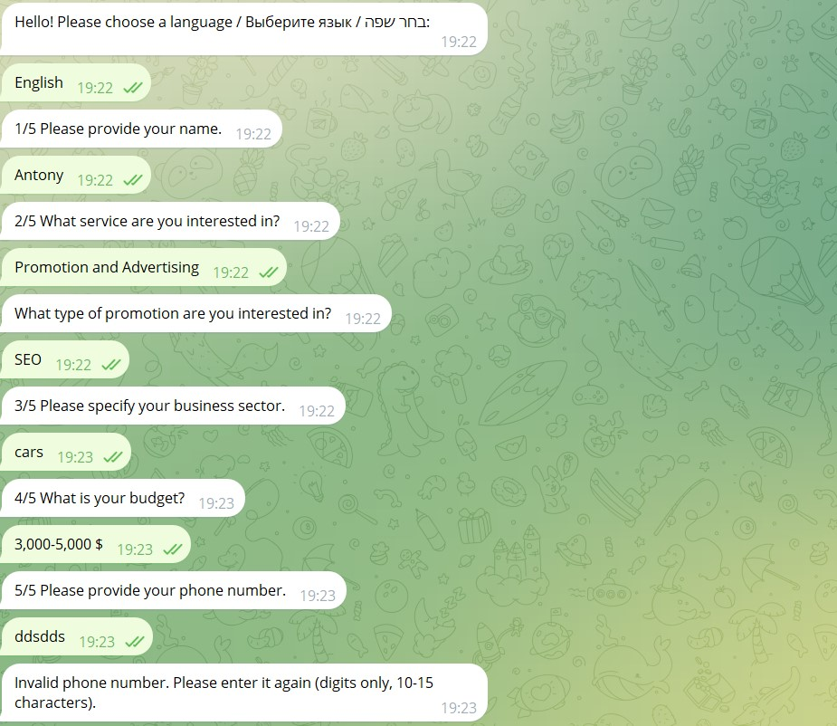

# Telegram Bot for Web Agency

## Project Overview
This project is a **multilingual Telegram bot** designed for a web agency to **automate client inquiries**, provide fast responses, and **streamline data collection**.  
The bot supports **English, Hebrew, and Russian**, and integrates with **Google Sheets API** to store and manage collected data.

---

## 🚀 Features
✅ **Multilingual Support (English, Hebrew, Russian)**  
✅ **User-friendly interaction flow** (structured questions & responses)  
✅ **Automated lead collection** (stores client info in Google Sheets)  
✅ **Inline keyboards & state tracking** for user responses  
✅ **Phone number validation** to ensure data accuracy  
✅ **Web agency service selection** (Website, Advertising, Consultation)  

---

## 🛠 Technologies Used
- **Python** (Core bot functionality)
- **python-telegram-bot** (Telegram API interaction)
- **pyTelegramBotAPI** (Message handling & inline keyboards)
- **gspread & oauth2client** (Google Sheets API for data storage)
- **SQLite** (Optional for local user state tracking)
- **Flask** (For potential webhook hosting)
- **NestAsyncio** (To allow async operations within notebooks)

---

